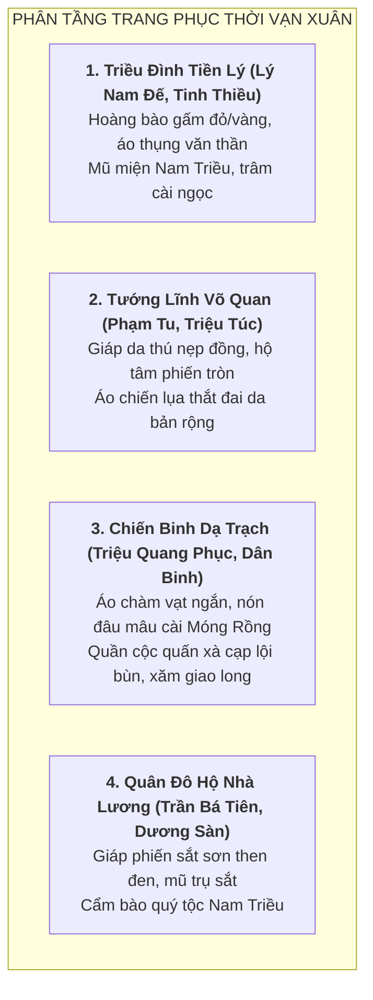

# Văn Hóa Vật Chất, Quân Sự & Kiến Trúc: Thời Kỳ Nước Vạn Xuân (541–602 SCN)

> [!IMPORTANT]
> **Ràng Buộc Khảo Cứu Mỹ Thuật & Khảo Cổ (Task `VS-VX-01`)**:
> - Tài liệu này nghiên cứu phục dựng văn hóa vật chất, trang phục, vũ khí, phương tiện thủy chiến và kiến trúc thành quách thời Tiền Lý (Thế kỷ VI).
> - Cung cấp cơ sở mỹ thuật chân thực và giàu tính lịch sử cho các đội ngũ Pixel Art, UI, Environment và Narrative của dự án *Huyền Sử TD*.
> - **KHÔNG gắn chỉ số cân bằng game hay thông số stats/waves**.

---

## 1. Trang Phục & Diện Mạo (Costumes & Aesthetics)



### 1.1. Trang Phục Triều Đình Nước Vạn Xuân (544 SCN)
* **Lý Nam Đế**:
  * Chiến bào và hoàng bào bằng lụa gấm đỏ son (hoặc vàng kim) dệt hoa văn sóng nước và mặt trời Lạc Việt.
  * Trước ngực đeo Hộ tâm phiến đồng tròn đúc nổi hoa văn chim Lạc / mặt trời; thắt lưng da bò nẹp khóa đồng.
  * Mũ đâu mâu đồng mạ vàng có chỏm lông chim trĩ hoặc mũ miện bình thiên thời Nam Triều khi thiết triều tại điện Vạn Thọ.
* **Văn thần Tinh Thiều**:
  * Áo thụng tay rộng bằng vải chàm sẫm màu dệt thủ công, cổ áo vạt chéo gập chữ Y; đầu đội khăn vấn vải chàm hoặc nón cánh chuồn sơ kỳ; tay cầm thẻ tre và túi gấm đựng bút nghiên.

---

### 1.2. Trang Phục Chiến Binh & Dân Binh Đầm Dạ Trạch
* **Triệu Quang Phục (Dạ Trạch Vương)**:
  * Trang phục áo chàm ngắn tay cơ động, váy ngắn xẻ tà hoặc quần túm ống trên gối quấn xà cạp vải gai chắc chắn giúp lội bùn nhanh nhẹn.
  * Đội nón **đâu mâu bằng da trâu thuộc bọc đồng**, đỉnh nón gắn chiếc **Móng Rồng** (Long Trảo — chi tiết biểu tượng Folklore) làm bùa hộ mệnh.
  * Cổ tay và cổ chân bọc hộ uyển da thuộc; cánh tay để lộ hình xăm giao long truyền thống.
* **Nghĩa quân Dạ Trạch (Ngư binh đầm lầy)**:
  * Áo cộc vải thô màu nâu đất hoặc xanh chàm ngụy trang trong lau sậy; đầu quấn khăn chàm gọn gàng; mình trần xăm giao long khi bơi lội tác chiến ban đêm.

---

## 2. Vũ Khí & Trang Bị Quân Sự (Weapons & Equipment)

| Hạng Mục | Nghĩa Quân Nước Vạn Xuân | Quân Đô Hộ Nhà Lương |
|---|---|---|
| **Vũ khí cận chiến** | Giáo búp đa mũi đồng/sắt cán tre đực dài; Song đao đồng Lạc Việt; Dao găm chuôi chữ T; Rìu chiến đồng xòe cân. | Hoàn Thủ đao thép rèn bản rộng; Trường thương kích sắt; Câu liêm kích chuyên leo phá công sự. |
| **Vũ khí tầm xa** | Nỏ thân gỗ nẹp gân trâu dẻo dai lẫy đồng; Tên nứa già bịt đồng; Lao phóng vạt nhọn ngâm dầu; Cung mây dẻo. | Nỏ quân dụng cơ khí hạng nặng; Ống tên sắt đầu ba cạnh xuyên giáp; Cung phức hợp gỗ - sừng - gân. |
| **Phòng ngự** | Khiên mây đan tròn bọc da trâu nẹp đồng; Giáp da thú nẹp phiến đồng tròn; Áo giáp độn bông gai. | Khiên chữ nhật lớn bằng gỗ bọc da nẹp sắt (Mộc thuẫn); Giáp phiến sắt sơn then đen (Minh Quang khải sơ kỳ). |
| **Thủy chiến** | Thuyền độc mộc thân gỗ khoét rỗng dài 6–8m (nhẹ, luồn lách êm ru); Thuyền chiến sông ngòi đáy bằng gỗ lim. | Lâu thuyền (chiến hạm lớn nhiều tầng có lầu bắn nỏ); Mông xung (thuyền bọc da trâu chống cháy). |

---

## 3. Khảo Cứu Địa Hình & Kiến Trúc Chiến Trường

```text
+---------------------------------------------------------------------------------------------------+
|                        MÔ HÌNH ĐỊA HÌNH CHIẾN TRƯỜNG THỜI VẠN XUÂN                                |
+---------------------------------------------------------------------------------------------------+
|                                                                                                   |
|  [ĐẦM DẠ TRẠCH - HƯNG YÊN]                                                                       |
|  Bãi đầm lầy mênh mông bãi Màn Trù ---> Rừng lau sậy cao ngút đầu ---> Lạch nước bùn sâu         |
|  Đại bản doanh là bãi đất nổi bí mật ở trung tâm, chỉ đi vào được bằng thuyền độc mộc              |
|                                                                                                   |
|  [PHÒNG TUYẾN SÔNG CHU DIÊN & THÀNH TÔ LỊCH]                                                      |
|  Ngã ba sông Tô Lịch - Sông Hồng ---> Chiến lũy gỗ lim ken đất nện ---> Bãi cọc tre cắm ngầm       |
|                                                                                                   |
|  [HỒ ĐIỂN TRIỆT - VĨNH PHÚC]                                                                      |
|  Đầm hồ tự nhiên lòng chảo ---> Vách đá & rừng cây bao bọc ---> Vạn chiến thuyền neo đậu          |
|                                                                                                   |
|  [CHÙA KHAI QUỐC - HÀ NỘI]                                                                        |
|  Tháp Phật gỗ nhiều tầng ---> Chuông đồng Thiên Đức ---> Đặt bên bãi bồi hồ Lãng Bạc (Hồ Tây)     |
|                                                                                                   |
+---------------------------------------------------------------------------------------------------+
```

### 3.1. Căn Cứ Đầm Dạ Trạch (Khoái Châu, Hưng Yên)
* **Đặc điểm địa lý**:
  * Là vùng đầm lầy trũng thấp ven sông Hồng (bãi Màn Trù, bãi Tự Nhiên cổ), quanh năm ngập nước, bùn lầy phù sa ngập sâu lút đầu gối.
  * Bạt ngàn lau sậy, cỏ lác và bèo tấm cao vượt đầu người, tạo thành mê cung tự nhiên hiểm hóc che khuất hoàn toàn tầm nhìn.
* **Cách thức đóng quân**:
  * Đại bản doanh đặt trên các cồn đất nổi ở giữa đầm; ban ngày không dựng lều trại nổi, không nấu cơm nổi lửa; quân sĩ nghỉ ngơi trên các chòi tre ngụy trang dưới tán lau sậy.

---

### 3.2. Hồ Điển Triệt (Lập Thạch, Vĩnh Phúc)
* **Đặc điểm địa lý**:
  * Vùng hồ đầm tự nhiên hình móng ngựa ăn thông với sông Lô; mặt hồ phẳng lặng, xung quanh là đồi núi rậm rạp và vách đá cheo leo của dãy Tam Đảo.
  * Là nơi neo đậu của hàng vạn thuyền chiến lớn nhỏ của Lý Nam Đế trước khi bị Trần Bá Tiên lợi dụng lũ lụt đánh úp.

---

### 3.3. Chùa Khai Quốc (Trấn Quốc) & Điện Vạn Thọ
* **Ý nghĩa kiến trúc & Biểu tượng văn hóa**:
  * Được dựng năm 544 bên bờ sông Hồng / hồ Lãng Bạc (Hồ Tây).
  * Kiến trúc mang phong cách Phật giáo cổ truyền: Tháp gạch/gỗ nhiều tầng thờ Xá lợi Phật, đúc chuông đồng lớn, điện thờ bằng gỗ lim lợp ngói mũi hài.
  * Tượng trưng cho sự hưng khởi, mở nước (*Khai Quốc*) và nền thái bình thịnh trị của muôn vạn mùa xuân (*Vạn Xuân*).

---

## 4. Di Vật Khảo Cổ & Tiền Tệ Chủ Quyền

* **Tiền đồng Thiên Đức Thông Bảo / Tiền Vạn Xuân**:
  * Tiền kim loại đúc bằng đồng thủ công hình tròn có lỗ vuông ở giữa, khắc 4 chữ Hán *"Thiên Đức Thông Bảo"*.
  * Là đồng tiền độc lập đầu tiên trong lịch sử tiền tệ Việt Nam, khẳng định nền kinh tế tự chủ hoàn toàn của triều đình Lý Nam Đế.
* **Gạch ngói & Gốm thời Tiền Lý**:
  * Các lò gốm cổ vùng Luy Lâu, Long Biên sản xuất gạch nung có hoa văn trám lồng, ngói tráng men nhẹ và đầu ngói ống trang trí họa tiết mặt thú / hoa sen thời Lục Triều và Đông Sơn muộn.
