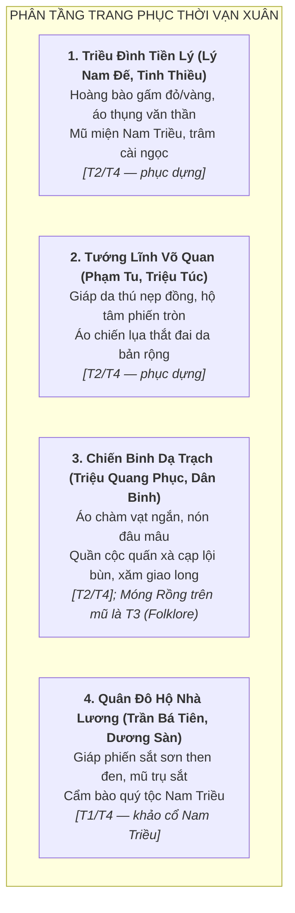

# Văn Hóa Vật Chất, Quân Sự & Kiến Trúc: Thời Kỳ Nước Vạn Xuân (541–602 SCN)

> [!IMPORTANT]
> **Ràng Buộc Khảo Cứu Mỹ Thuật & Khảo Cổ (Task `VS-VX-01`)**:
> - Tài liệu này nghiên cứu phục dựng văn hóa vật chất, trang phục, vũ khí, phương tiện thủy chiến và kiến trúc thành quách thời Tiền Lý (Thế kỷ VI).
> - Cung cấp cơ sở mỹ thuật cho các đội ngũ Pixel Art, UI, Environment và Narrative của dự án *Huyền Sử TD*.
> - **KHÔNG gắn chỉ số cân bằng game hay thông số stats/waves**.

> [!WARNING]
> **Tầng nguồn**: Phần lớn chi tiết trang phục, chiến thuật, kiến trúc dưới đây xuất phát từ **T2 (Later Vietnamese historiography)** hoặc **T4 (modern reconstruction)**. Các chi tiết cụ thể như thuyền độc mộc, chiến thuật đêm, Móng Rồng là **T2/T3** — cần gắn nhãn rõ khi dùng trong tài liệu thiết kế game. Xem [sources.md](sources.md) để tra tầng nguồn.

---

## 1. Trang Phục & Diện Mạo (Costumes & Aesthetics)

> [!NOTE]
> Tất cả chi tiết trang phục dưới đây là **phục dựng dựa trên T2 (chính sử trung đại) + T4 (khảo cổ học Nam Triều và hình tượng học thế kỷ VI)**, không có hiện vật thực tế nào từ thế kỷ VI còn được tìm thấy tại Giao Châu để xác nhận trực tiếp.



### 1.1. Trang Phục Triều Đình Nước Vạn Xuân (544 SCN) [T2/T4 — phục dựng]
* **Lý Nam Đế**:
  * Chiến bào và hoàng bào bằng lụa gấm dệt hoa văn — chi tiết màu sắc và họa tiết cụ thể là **phục dựng T4** dựa trên hình tượng học Nam Triều và trang phục Đông Sơn muộn; không có hiện vật Giao Châu thế kỷ VI nào xác nhận trực tiếp.
  * Mũ đâu mâu đồng khi ra trận, mũ miện triều chính — phỏng theo hình tượng học hoàng đế Nam Triều (T4).
* **Văn thần Tinh Thiều**:
  * Áo thụng tay rộng vải chàm, cổ áo vạt chéo — phỏng theo y phục quan văn Nam Triều và Giao Châu thế kỷ VI (T4).

---

### 1.2. Trang Phục Chiến Binh & Dân Binh Đầm Dạ Trạch [T2/T3/T4]
* **Triệu Quang Phục (Dạ Trạch Vương)**:
  * Trang phục áo chàm ngắn tay cơ động, quần vải gai, xà cạp — gợi ý T4 dựa trên thực hành chiến binh vùng sông nước.
  * Đội nón đâu mâu da trâu bọc đồng — T4 phục dựng.
  * **Móng Rồng (Long Trảo) gắn trên mũ** — chi tiết này thuần túy là **T3 (Folklore)** từ *Lĩnh Nam Chích Quái*. Đây là biểu tượng narrative / tâm linh, **không phải hiện vật lịch sử**.
  * Hình xăm giao long — được ghi nhận trong T1/T2 như thực hành của người Việt cổ chống thuồng luồng (có cơ sở T1 từ *Nam Việt Chí* và tài liệu Hán thế kỷ II–VI, nhưng áp dụng cụ thể cho chiến binh Dạ Trạch là T4).
* **Nghĩa quân Dạ Trạch (Ngư binh đầm lầy)**:
  * Áo cộc vải thô màu chàm ngụy trang — T4 phục dựng. Không có tả cụ thể trong T1 hay T2.

---

## 2. Vũ Khí & Trang Bị Quân Sự (Weapons & Equipment)

> [!NOTE]
> Danh sách vũ khí dưới đây tổng hợp từ: (1) hiện vật khảo cổ Đông Sơn muộn và Nam Triều thế kỷ V–VI tại Việt Nam và Trung Hoa (T4); (2) mô tả chiến dịch trong T1 (*Trần Thư*, *Lương Thư*). T1 mô tả kết quả trận đánh nhưng **không liệt kê loại vũ khí cụ thể** được dùng bởi nghĩa quân Giao Châu.

| Hạng Mục | Nghĩa Quân Nước Vạn Xuân [T4 phục dựng] | Quân Đô Hộ Nhà Lương [T1/T4] |
|---|---|---|
| **Vũ khí cận chiến** | Giáo mũi đồng/sắt cán tre; Đao ngắn; Dao găm; Rìu chiến đồng — theo khảo cổ Đông Sơn muộn. | Hoàn Thủ đao thép; Trường thương kích sắt — theo khảo cổ Nam Triều. |
| **Vũ khí tầm xa** | Nỏ gỗ lẫy đồng; Lao phóng — loại vũ khí đã được ghi nhận trong tư liệu Hán về Giao Châu (T4). | Nỏ quân dụng; Cung phức hợp — theo khảo cổ Nam Triều. |
| **Phòng ngự** | Khiên mây đan bọc da; Giáp da thú — T4 phục dựng. | Khiên Mộc thuẫn; Giáp phiến sắt — có hiện vật Nam Triều tham chiếu. |
| **Thủy chiến** | Thuyền độc mộc và thuyền sông ngòi — **T2 (*Toàn Thư*) đề cập chiến thuật thuyền nhỏ ở Dạ Trạch; loại thuyền cụ thể là T4**. | Lâu thuyền; Mông xung — được mô tả trong T1 (*Trần Thư*) về chiến dịch sông hồ. |

---

## 3. Khảo Cứu Địa Hình & Kiến Trúc Chiến Trường

> [!WARNING]
> **Vị trí địa danh**: Các địa danh chiến trường (Chu Diên, Tô Lịch) được xác nhận trong T1 (*Trần Thư*). **Điển Triệt và Khuất Lão / Khuất Nao là các địa danh có tên trong T1 nhưng vị trí hiện đại còn tranh luận** — T2 (*Cương Mục*) đề xuất vị trí cụ thể nhưng giới học giả T4 chưa hoàn toàn đồng thuận.

```text
+-------------------------------------------------------------------------------------------------------+
|              MÔ HÌNH ĐỊA HÌNH CHIẾN TRƯỜNG THỜI VẠN XUÂN (nguồn & mức chắc chắn)                    |
+-------------------------------------------------------------------------------------------------------+
|  [ĐẦM DẠ TRẠCH] — Khoái Châu, Hưng Yên  [T2/T4 — đề xuất; chưa xác nhận khảo cổ]                  |
|  Bãi đầm lầy mênh mông lau sậy --> Lạch nước bùn sâu --> Cồn đất nổi ẩn náu                         |
|                                                                                                       |
|  [CHU DIÊN & TÔ LỊCH]  [T1 — xác nhận gần thời; vị trí cổ có tranh luận nhỏ T4]                    |
|  Ngã ba sông Tô Lịch - Sông Hồng --> Chiến lũy gỗ đất --> Trận địa phòng thủ                         |
|                                                                                                       |
|  [ĐIỂN TRIỆT]  T1 xác nhận tên; vị trí hiện đại [TRANH LUẬN — T2 đề xuất Lập Thạch/Vĩnh Phúc]      |
|  Đầm hồ tự nhiên ăn thông sông --> Vách núi & rừng bao bọc                                           |
|                                                                                                       |
|  [KHUẤT LÃO / KHUẤT NAO]  T1 (tên bất nhất giữa bản chép); vị trí [CHƯA XÁC ĐỊNH]                  |
|  T2 đề xuất Tam Nông, Phú Thọ; chưa có khảo cổ xác nhận                                              |
|                                                                                                       |
|  [CHÙA KHAI QUỐC]  T2 ghi năm 544; vị trí cụ thể không xác nhận bởi T1                              |
|  Liên kết với Chùa Trấn Quốc (Tây Hồ, Hà Nội) = LOCAL TRADITION (T3)                               |
+-------------------------------------------------------------------------------------------------------+
```

### 3.1. Căn Cứ Đầm Dạ Trạch [T2/T4]
* **Nguồn**: *Toàn Thư* (T2) ghi Triệu Quang Phục rút về đầm Dạ Trạch, dùng chiến thuật ban đêm. Vị trí "vùng bãi Màn Trù, Khoái Châu, Hưng Yên" là đề xuất của T2 (*Cương Mục*) và T4; chưa có khai quật khảo cổ học xác nhận địa điểm chính xác của đại bản doanh.
* **Đặc điểm địa lý** (T4 — phục dựng từ địa mạo học hiện đại):
  * Vùng đất thấp trũng ven sông Hồng, nhiều đầm hồ và lau sậy, phù hợp với mô tả của T2 về địa hình lẩn trốn và tập kích.

---

### 3.2. Hồ Điển Triệt [T1 tên; T2 vị trí — tranh luận]
* **T1 — *Trần Thư***: Xác nhận tên địa điểm (phiên âm 典徹 / 典撤) là nơi diễn ra chiến dịch thủy quân.
* **T2 — *Cương Mục***: Đề xuất vị trí tại Lập Thạch, Vĩnh Phúc (vùng hồ đầm ăn thông sông Lô).
* **Tranh luận T4**: Một số học giả gợi ý vị trí khác gần sông Lô hoặc sông Đà. **Vị trí chưa được xác định dứt khoát**. Không ghi "Lập Thạch, Vĩnh Phúc" như thể đã là sự thật xác nhận.

---

### 3.3. Chùa Khai Quốc & Điện Vạn Thọ [T2; liên kết với Trấn Quốc là T3]
* **T2 — *Toàn Thư***: Ghi Lý Nam Đế cho lập chùa Khai Quốc năm 544. Không có mô tả kiến trúc chi tiết trong T2.

> [!CAUTION]
> **Đồng nhất Khai Quốc với Chùa Trấn Quốc (Tây Hồ, Hà Nội) ngày nay là LOCAL TRADITION (T3)** — dựa trên truyền thống của chính ngôi chùa đó. T1 và T2 không xác nhận vị trí địa lý cụ thể của Khai Quốc. Khi dùng hình ảnh Chùa Trấn Quốc trong game, cần ghi rõ đây là "gợi ý truyền thống / artistic interpretation".

* **Kiến trúc phục dựng** (T4): Tháp gỗ nhiều tầng, mái cong lợp ngói, theo phong cách Phật giáo Nam Triều thế kỷ VI — phỏng từ tư liệu khảo cổ học Trung Hoa và Việt Nam cùng thời.

---

## 4. Di Vật Khảo Cổ & Tiền Tệ

### 4.1. Tiền Đồng "Thiên Đức Thông Bảo" [Disputed / Unverified by archaeology]

* **T2 — *Toàn Thư***: Ghi việc Lý Nam Đế "đúc tiền" năm 544.

> [!CAUTION]
> Tên cụ thể **"Thiên Đức thông bảo"** (天德通寶) xuất hiện trong một số ghi chép trung đại và tài liệu tiền học sau này. **Tuy nhiên, đến nay chưa có đồng tiền nào mang tên này được xác nhận bởi khảo cổ học một cách dứt khoát** là từ thời Lý Nam Đế. Attribution này cần ghi là `[T2 — tên theo sau; chưa xác nhận bởi khảo cổ học]`. Không trình bày như historical fact đã được xác nhận.

### 4.2. Gạch Ngói & Gốm Thời Tiền Lý [T4]
* Các lò gốm vùng Luy Lâu, Long Biên sản xuất gạch nung hoa văn trám lồng và ngói mũi hài thời Lục Triều và Đông Sơn muộn — **xác nhận bởi khảo cổ học hiện đại (T4)**; cung cấp cơ sở tham chiếu cho mỹ thuật kiến trúc trong game.
