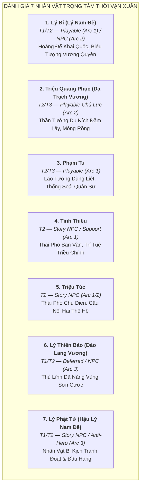

# Tuyển Chọn Roster & Phân Định Vai Trò Nhân Vật Thời Kỳ Vạn Xuân (541–602 SCN)

> [!IMPORTANT]
> **Ràng Buộc Thiết Kế & Nguyên Tắc Cách Ly Ngữ Cảnh (Task `VS-VX-02`)**:
> - Tài liệu này tuyển chọn và phân định vai trò các nhân vật (**Playable Hero**, **Story NPC**, **Deferred Candidate**, **Enemy / Boss Candidate**) cho từng Arc chiến dịch thời kỳ Vạn Xuân.
> - **TUYỆT ĐỐI KHÔNG LÀM GAMEPLAY DESIGN / CODE**:
>   - Không tạo chỉ số Stats (HP, ATK, Range, AttackSpeed, Movement Speed).
>   - Không thiết kế Skill, Active Effects, TriggerHits.
>   - Không tạo Wave data, không tạo Asset PNG, không sửa `src/**` và `PROJECT_PLAN.md`.
> - Mọi nhân vật đều được gắn nhãn tầng nguồn học thuật nghiêm ngặt: **T1** (Historical near-source) / **T2** (Later historiography) / **T3** (Folklore & Legend) / **T4** (Game interpretation).

---

## 1. Đánh Giá Chuyên Sâu 7 Nhân Vật Trọng Tâm (Deep Evaluation Matrix)



---

### 1.1. Lý Bí (Lý Nam Đế) — Hoàng Đế Khai Quốc

* **Tầng nguồn**: **T1 (sự kiện khởi nghĩa) + T2 (danh hiệu, quốc hiệu, triều đình)**.
  * *T1 — Lương Thư, Trần Thư*: Xác nhận thủ lĩnh khởi nghĩa 541 SCN, đánh đuổi Tiêu Tư, giao tranh với Trần Bá Tiên tại Chu Diên, Điển Triệt, Khuất Lão.
  * *T2 — Toàn Thư, Cương Mục*: Bổ sung thụy xưng Lý Nam Đế, quốc hiệu Vạn Xuân, niên hiệu Thiên Đức, dựng chùa Khai Quốc.
* **Đánh giá vị thế thiết kế**:
  * **Vai trò khuyến nghị**: **Playable Hero Chủ Lực (Arc 1)** / **Story NPC Tối Cao (Arc 2)**.
  * **Định hướng hình tượng (Conceptual)**: *Hoàng Đế Chỉ Huy / Hào Quang Khai Quốc (Commander / Aura Buffer)*.
  * **Lý do chọn**: Lý Nam Đế là linh hồn của toàn bộ thời kỳ Vạn Xuân, người đầu tiên xưng Nam Đế và đặt quốc hiệu độc lập. Không thể thiếu trong bất kỳ danh mục Hero Việt Sử nào.

---

### 1.2. Triệu Quang Phục (Dạ Trạch Vương / Triệu Việt Vương) — Thần Tướng Đầm Lầy

* **Tầng nguồn**: **T2 (chính sử Việt Nam) + T3 (truyền thuyết dân gian & Lĩnh Nam Chích Quái)**.
  * *T2 — Toàn Thư, Cương Mục*: Ghi nhận kế thừa quyền bính từ Lý Nam Đế, xây dựng căn cứ đầm Dạ Trạch, chém Dương Sàn, xưng Triệu Việt Vương đóng đô Long Biên (550 SCN).
  * *T3 — Thần tích Hưng Yên, Lĩnh Nam Chích Quái*: Truyền thuyết Chử Đồng Tử ban Móng Rồng gắn trên nón đâu mâu.
* **Đánh giá vị thế thiết kế**:
  * **Vai trò khuyến nghị**: **Playable Hero Chủ Lực Số 1 (Arc 2)** / **Story NPC (Arc 3)**.
  * **Định hướng hình tượng (Conceptual)**: *Chiến Tướng Du Kích Đầm Lầy / Tốc Kích Thủy Chiến (Skirmisher / Trap Specialist)*.
  * **Lý do chọn**: Triệu Quang Phục là nhân vật quân sự sáng chói và độc đáo nhất thời kỳ này. Chiến thuật du kích đầm lầy và biểu tượng Móng Rồng tạo ra sự đột phá tuyệt đối về gameplay mechanics trong Tower Defense.

---

### 1.3. Phạm Tu (Đại Tướng Quân / Lão Tướng Phạm Lão Đổng)

* **Tầng nguồn**: **T2 (chính sử Việt Nam) + T3 (thần phả Đình Thanh Liệt)**.
  * *T2 — Toàn Thư, Cương Mục*: Đứng đầu ban võ triều Vạn Xuân, thống lĩnh đại quân đánh tan giặc Lâm Ấp xâm lấn phương Nam (543 SCN), tử thủ phòng tuyến sông Tô Lịch (545 SCN).
  * *T3 — Thần tích Thanh Liệt*: Tôn vinh là Đô Hồ Đại Vương, ghi nhận thọ ngoài 70 tuổi vẫn cầm đao xông trận.
* **Đánh giá vị thế thiết kế**:
  * **Vai trò khuyến nghị**: **Playable Hero (Arc 1)**.
  * **Định hướng hình tượng (Conceptual)**: *Lão Tướng Hộ Vệ / Thiết Giáp Trấn Thủ (Heavy Guardian / Area Controller)*.
  * **Lý do chọn**: Bổ khuyết hoàn hảo cho đội hình chiến đấu cận chiến phòng ngự; đại diện cho sức mạnh quân sự chính quy bảo vệ non sông Vạn Xuân thuở sơ khai.

---

### 1.4. Tinh Thiều (Quảng Dương Môn Lang / Thái Phó Ban Văn)

* **Tầng nguồn**: **T2 (Toàn Thư, Cương Mục, Việt Sử Tiêu Án)**.
  * *T2*: Người học rộng tài cao, từng sang triều Lương xin quan tước nhưng chỉ được phong chức *Quảng Dương môn lang* (viên lang coi giữ cửa Quảng Dương hoàng thành) do chính sách phân biệt môn đệ phong kiến phương Bắc. Phẫn chí trở về phò tá Lý Bí, đứng đầu ban văn Vạn Xuân.
* **Đánh giá vị thế thiết kế**:
  * **Vai trò khuyến nghị**: **Story NPC Cố Vấn / Support Hero (Arc 1)**.
  * **Định hướng hình tượng (Conceptual)**: *Văn Thần Chiến Thuật / Trợ Lực Trận Địa (Tactical Support / Buffer)*.
  * **Lý do chọn**: Tinh Thiều là đại diện tiêu biểu cho tầng lớp trí thức bản địa thức tỉnh tinh thần tự tôn dân tộc. Tuy nhiên, do bản chất là văn thần hành chính, ông phù hợp đóng vai trò Story NPC dẫn dắt cốt truyện hoặc Hero thuần hỗ trợ (Support) hơn là tướng trực tiếp cận chiến.

---

### 1.5. Triệu Túc (Thái Phó / Hào Trưởng Chu Diên)

* **Tầng nguồn**: **T2 (Toàn Thư, Cương Mục)**.
  * *T2*: Tù trưởng danh vọng vùng Chu Diên, cha của Triệu Quang Phục. Là một trong những hào trưởng lớn đầu tiên đem toàn bộ lực lượng gia tộc theo Lý Bí dấy nghĩa, được phong chức Thái phó.
* **Đánh giá vị thế thiết kế**:
  * **Vai trò khuyến nghị**: **Story NPC (Arc 1 & Arc 2)** — *Không khuyến nghị làm Playable Hero độc lập*.
  * **Lý do loại bỏ khỏi Playable**: Hành trạng chiến đấu cá nhân không được ghi chép nổi bật bằng con trai Triệu Quang Phục hay Lão tướng Phạm Tu. Triệu Túc đóng vai trò hoàn hảo làm nhân vật cốt truyện (NPC) kết nối mối liên minh giữa họ Lý và họ Triệu qua 2 Arc.

---

### 1.6. Lý Thiên Bảo (Đào Lang Vương)

* **Tầng nguồn**: **T1 (Trần Thư, Lương Thư) + T2 (Toàn Thư, Cương Mục)**.
  * *T1/T2*: Anh trai của Lý Bí. Sau khi hồ Điển Triệt thất thủ, cùng Lý Phật Tử đem 3 vạn quân rút về vùng rừng núi Tây Bắc / Ai Lao, chiếm giữ động Dã Năng, tự xưng là Đào Lang Vương, lập nước Dã Năng.
* **Đánh giá vị thế thiết kế**:
  * **Vai trò khuyến nghị**: **Deferred Candidate (Dành cho Arc 3)** / **Story NPC liên quân**.
  * **Định hướng hình tượng (Conceptual)**: *Sơn Cước Thủ Lĩnh / Xạ Thủ Vùng Núi (Mountain Ranger)*.
  * **Lý do chưa nên dùng ở Arc 1/2**: Hành động của Lý Thiên Bảo chủ yếu diễn ra ở vùng biên viễn phía Tây trong giai đoạn sau năm 548 SCN, tách biệt khỏi chiến trường trung tâm đầm Dạ Trạch của Triệu Quang Phục.

---

### 1.7. Lý Phật Tử (Hậu Lý Nam Đế)

* **Tầng nguồn**: **T1 (Tùy Thư - Lưu Phương truyện) + T2 (Toàn Thư, Cương Mục)**.
  * *T1/T2*: Tướng lĩnh kế thừa lực lượng của Lý Thiên Bảo tại Dã Năng. Sau đó đem quân về tranh chấp Chu Diên với Triệu Quang Phục; dùng mưu cầu hôn giả mạo (Nhã Lang - Cảo Nương) để đánh tráo Móng Rồng, đánh úp cướp ngôi Triệu Việt Vương (571 SCN). Đến năm 602 SCN, trước đại quân viễn chinh nhà Tùy của Lưu Phương, Lý Phật Tử đã đầu hàng và bị bắt về phương Bắc.
* **Đánh giá vị thế thiết kế**:
  * **Vai trò khuyến nghị**: **Story NPC Phức Tạp / Anti-Hero / Boss Cốt Truyện trong Arc 3** — **TUYỆT ĐỐI KHÔNG LÀM PLAYABLE HERO CHÍNH DIỆN TRONG ARC 1 & 2**.
  * **Lý do không chọn làm Playable Hero**: Nhân vật mang tính chất phản trắc trong truyền thống lịch sử văn hóa dân tộc, kết cục đầu hàng nhà Tùy làm mất nước Vạn Xuân. Chỉ phù hợp làm nhân vật đối trọng (Antagonist/Anti-hero) trong chương truyện Hậu Vạn Xuân.

---

## 2. Đề Xuất Roster 3 Hero Cho Từng Arc

```mermaid
graph TD
    subgraph ROSTER ĐỀ XUẤT 3 HERO CHO TỪNG ARC
        subgraph ARC 1: KHAI SINH VẠN XUÂN
            A1_H1["1. Lý Bí (Lý Nam Đế)<br><i>Commander / Aura Buffer</i>"]
            A1_H2["2. Phạm Tu (Đại Tướng Quân)<br><i>Heavy Guardian Tanker</i>"]
            A1_H3["3. Tinh Thiều (Thái Phó Ban Văn)<br><i>Tactical Support Buffer</i>"]
        end
        subgraph ARC 2: DẠ TRẠCH QUẬT KHỞI
            A2_H1["1. Triệu Quang Phục (Dạ Trạch Vương)<br><i>Skirmisher / Trap Specialist</i>"]
            A2_H2["2. Cảo Nương (Nữ Tướng Tiên Phong — T3)<br><i>Ranged Archer Scout</i>"]
            A2_H3["3. Dạ Trạch Ngư Binh (Dũng Sĩ Đầm Lầy — T4)<br><i>Amphibious Fast Striker</i>"]
        end
        subgraph ARC 3: HẬU VẠN XUÂN (DỰ TRÙ)
            A3_H1["1. Lý Thiên Bảo (Đào Lang Vương)<br><i>Mountain Ranger</i>"]
            A3_H2["2. Triệu Việt Vương (Hậu Kỳ Bi Kịch)<br><i>Story NPC / Hero</i>"]
            A3_H3["3. Tướng Quân Dã Năng (Sơn Cước Dân Binh — T4)<br><i>Heavy Striker</i>"]
        end
    end
```

---

## 3. Đề Xuất Kẻ Địch (Normal / Elite / Boss Candidates) Cho Từng Arc

> [!NOTE]
> Toàn bộ các đề xuất kẻ địch dưới đây chỉ mang tính chất **định hướng tạo hình và hành vi chiến thuật (Conceptual Mechanics)** phục vụ thiết kế Level/Wave sau này, **hoàn toàn không chứa chỉ số Stats hay code logic**.

---

### 3.1. Kẻ Địch Arc 1 (Chiến Dịch Khai Sinh Vạn Xuân — Quân Nhà Lương)

| Phân Loại | Tên Kẻ Địch / Boss | Tầng Nguồn | Định Hướng Tạo Hình & Hành Vi Ý Niệm |
|---|---|:---:|---|
| **Normal Enemy 1** | **Lương Thiết Giáp Sĩ** | T1 | Bộ binh mang giáp sắt sơn then, khiên chữ nhật lớn; di chuyển chậm chạp, chống chịu sát thương vật lý cao. |
| **Normal Enemy 2** | **Lương Nỏ Thủ Cơ Giới** | T1 | Lính nỏ mang nỏ quân dụng lẫy đồng; có khả năng dừng lại bắn tỉa từ khoảng cách xa. |
| **Normal Enemy 3** | **Lương Giáo Binh Cản Phá** | T1 | Lính cầm thương dài 3m dàn hàng ngang; ngăn chặn đòn cận chiến của quân ta. |
| **Elite Enemy** | **Lương Tiên Phong Kỵ Tướng** | T1 | Kỵ binh thiết giáp Giang Nam cơ động tốc độ cao, có khả năng lao qua hàng phòng ngự tiền tiêu. |
| **Boss Candidate 1** | **Tiêu Tư** *(Thứ Sử Giao Châu)* | T1 | Boss mở màn; mang giáp quan lại lộng lẫy, có cơ chế ném vàng bạc hối lộ làm giảm tốc độ tấn công của Hero lân cận. |
| **Boss Candidate 2** | **Trần Bá Tiên** *(Đại Danh Tướng Nhà Lương)* | T1 | Boss tối hậu Arc 1; đại danh tướng thâm hiểm, máu dày, phát hào quang tăng giáp cho toàn quân và triệu hồi viện binh giáp sắt. |

---

### 3.2. Kẻ Địch Arc 2 (Chiến Dịch Dạ Trạch Quật Khởi — Quân Lương Vây Hãm Đầm Lầy)

| Phân Loại | Tên Kẻ Địch / Boss | Tầng Nguồn | Định Hướng Tạo Hình & Hành Vi Ý Niệm |
|---|---|:---:|---|
| **Normal Enemy 1** | **Lương Đầm Lầy Thủy Binh** | T1/T4 | Lính thủy mang giáp nhẹ, mang câu liêm; có khả năng bơi qua các lạch nước sâu trong đầm lầy. |
| **Normal Enemy 2** | **Lương Hỏa Xạ Thủ** | T1/T4 | Cung thủ bắn tên lửa vào các rặng lau sậy để triệt hạ nơi ẩn nấp của nghĩa quân. |
| **Normal Enemy 3** | **Dân Phu Khai Kênh Vây Hãm** | T1/T4 | Lao dịch đào hào đắp đê ngăn nước; xuất hiện theo bầy đàn đông đảo. |
| **Elite Enemy** | **Lương Đốc Chiến Hiệu Úy** | T1 | Viên chỉ huy tiền tuyến thúc ép quân lính tiến vào đầm sâu, liên tục buff cuồng nộ tăng tốc chạy. |
| **Boss Candidate** | **Dương Sàn** *(Tướng Lương Trấn Thủ)* | T1/T2 | Thống lĩnh đạo quân vây hãm Dạ Trạch; cưỡi chiến thuyền chỉ huy kiên cố, có cơ chế gọi hỏa tiễn dội xuống trận địa. |

---

### 3.3. Kẻ Địch Arc 3 (Chiến Dịch Hậu Vạn Xuân — Đại Quân Nhà Tùy)

| Phân Loại | Tên Kẻ Địch / Boss | Tầng Nguồn | Định Hướng Tạo Hình & Hành Vi Ý Niệm |
|---|---|:---:|---|
| **Normal Enemy 1** | **Tùy Giáp Sĩ Tinh Nhuệ** | T1 | Bộ binh thiết giáp hạng nặng thời Tùy, trang bị đao Hoàn Thủ thép rèn gấp và khiên lục giác. |
| **Normal Enemy 2** | **Tùy Thần Nỏ Binh** | T1 | Nỏ binh tầm xa trang bị nỏ lớn có sức công phá cực mạnh lên công trình phòng thủ. |
| **Normal Enemy 3** | **Tùy Thiết Mộc Phá Thành** | T1/T4 | Toán lính đẩy xe đục gỗ bọc da trâu chuyên phá hủy đồn lũy. |
| **Elite Enemy** | **Tùy Kỵ Binh Thảo Nguyên** | T1 | Kỵ binh du mục phương Bắc phục vụ nhà Tùy; tốc độ siêu nhanh và có khả năng bắn cung trên lưng ngựa. |
| **Boss Candidate** | **Lưu Phương** *(Đại Tướng Quân Nhà Tùy)* | T1 | Thống soái viễn chinh khét tiếng; có khả năng điều động trận địa kỵ bộ liên hoàn và mở đợt tổng tấn công dồn dập. |

---

## 4. Bảng Tổng Hợp Nhân Vật Toàn Thời Kỳ: Tầng Nguồn & Trạng Thái Phân Vai

| Nhân Vật / Thực Thể | Tầng Nguồn | Vai Trò Đề Xuất | Trạng Thái Trong Dự Án | Lý Do Tuyển Chọn / Loại Bỏ / Lùi Lại |
|---|:---:|---|:---:|---|
| **Lý Bí (Lý Nam Đế)** | **T1 / T2** | Hoàng Đế Khai Quốc | **Playable (Arc 1)** | Nhân vật trung tâm sáng lập nước Vạn Xuân, biểu tượng độc lập tối cao. |
| **Triệu Quang Phục** | **T2 / T3** | Dạ Trạch Vương | **Playable (Arc 2)** | Thiên tài quân sự du kích đầm lầy, bản sắc gameplay Tower Defense độc nhất vô nhị. |
| **Phạm Tu** | **T2 / T3** | Đại Tướng Quân | **Playable (Arc 1)** | Lão tướng dũng liệt phá Lâm Ấp, tử thủ Tô Lịch; trụ cột phòng ngự cận chiến. |
| **Tinh Thiều** | **T2** | Thái Phó Ban Văn | **Story NPC / Support (Arc 1)** | Trí tuệ triều chính Vạn Xuân; phù hợp làm NPC cốt truyện hoặc Support Hero. |
| **Cảo Nương** | **T3** | Nữ Tướng / Tiên Phong | **Playable Candidate (Arc 2)** | Nhân vật nữ anh hùng truyền thuyết đầm Dạ Trạch, bổ sung hỏa lực tầm xa. |
| **Dạ Trạch Ngư Binh** | **T4** | Dũng Sĩ Đầm Lầy | **Playable Candidate (Arc 2)** | Đại diện cho tinh thần dân quân áo chàm du kích, tốc độ xuất chiêu cao. |
| **Triệu Túc** | **T2** | Thái Phó Chu Diên | **Story NPC (Arc 1 & 2)** | Tù trưởng có công lớn quy tụ hào kiệt; không làm Playable vì thiếu hành trạng chiến đấu cá nhân. |
| **Lý Thiên Bảo** | **T1 / T2** | Đào Lang Vương | **Deferred (Arc 3)** | Hoạt động chủ yếu ở vùng Dã Năng hậu kỳ; lùi lại để tập trung cho Arc 1 và Arc 2. |
| **Lý Phật Tử** | **T1 / T2** | Hậu Lý Nam Đế | **Story NPC / Anti-Hero (Arc 3)** | Nhân vật bi kịch tranh đoạt ngôi báu; không chọn làm Playable Hero chính diện. |
| **Nhã Lang** | **T3** | Con Trai Lý Phật Tử | **Story NPC (Arc 3)** | Nhân vật truyền thuyết trong tích Móng Rồng; giữ vai trò NPC kịch bản. |
| **Trần Bá Tiên** | **T1** | Thống Soái Nhà Lương | **Boss Tối Hậu (Arc 1)** | Kình địch lớn nhất của Lý Nam Đế; đại danh tướng phương Bắc thời Nam Bắc Triều. |
| **Tiêu Tư** | **T1** | Thứ Sử Giao Châu | **Boss Mở Màn (Arc 1)** | Quan đô hộ tham lam, tàn bạo; nguyên nhân trực tiếp kích phát khởi nghĩa 541 SCN. |
| **Dương Sàn** | **T1 / T2** | Tướng Lương Trấn Thủ | **Boss Chiến Dịch (Arc 2)** | Viên tướng chỉ huy đạo quân vây hãm Dạ Trạch; bị Triệu Quang Phục chém tại trận. |
| **Lưu Phương** | **T1** | Đại Tướng Nhà Tùy | **Boss Tối Hậu (Arc 3)** | Viên tướng dập tắt nước Vạn Xuân năm 602 SCN; làm Boss cho giai đoạn mở rộng. |
| **Vua Lâm Ấp** | **T1 / T2** | Thế Lực Xâm Lấn Nam | **Boss Phụ Tuyến (Arc 1)** | Kẻ địch phương Nam bị Phạm Tu đánh tan tại Cửu Đức năm 543 SCN. |
