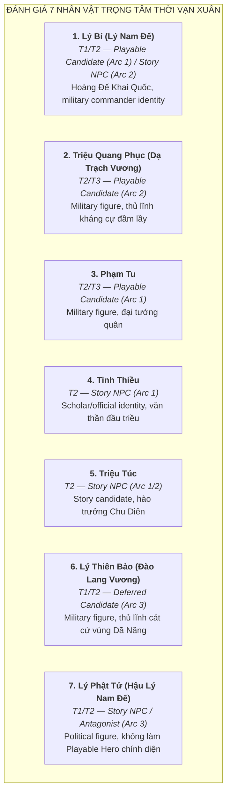
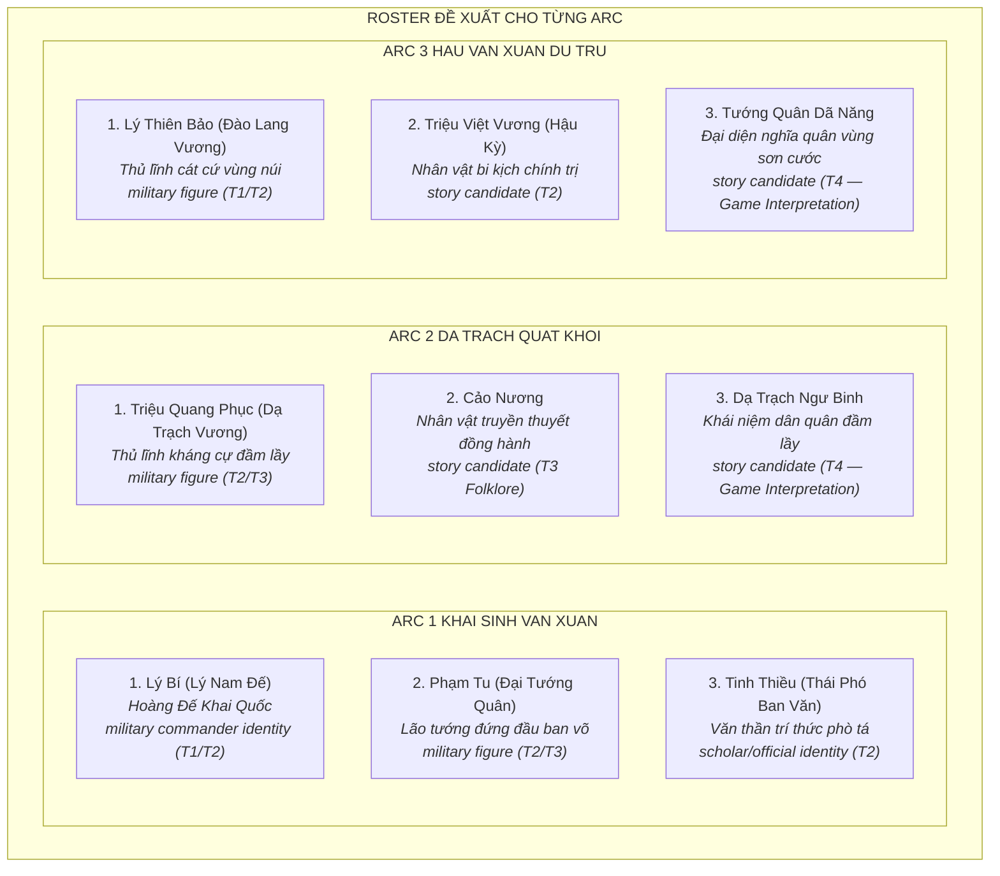

# Tuyển Chọn Roster & Phân Định Vai Trò Nhân Vật Thời Kỳ Vạn Xuân (541–602 SCN)

> [!IMPORTANT]
> **Ràng Buộc Thiết Kế & Nguyên Tắc Cách Ly Ngữ Cảnh (Task `VS-VX-02`)**:
> - Tài liệu này tuyển chọn và phân định vai trò các nhân vật (**Playable Hero Candidate**, **Story NPC**, **Deferred Candidate**, **Enemy / Boss Candidate**) cho từng Arc chiến dịch thời kỳ Vạn Xuân.
> - **TUYỆT ĐỐI KHÔNG LÀM GAMEPLAY DESIGN / CODE**:
>   - Không tạo chỉ số Stats (HP, ATK, Range, AttackSpeed, Movement Speed).
>   - Không thiết kế Skill, Active Effects, TriggerHits.
>   - Không tạo Wave data, không tạo Asset PNG, không sửa `src/**` và `PROJECT_PLAN.md`.
>   - Không dùng gameplay role label như: Aura Buffer, Tanker, Trap Specialist, Area Controller, Ranger, Skirmisher, Buffer.
> - Mọi nhân vật đều được gắn nhãn tầng nguồn học thuật nghiêm ngặt: **T1** (Historical near-source) / **T2** (Later historiography) / **T3** (Folklore & Legend) / **T4** (Game interpretation).
> - **Historical source of truth**: [character-roster-and-sources.md](character-roster-and-sources.md) và [historical-context-and-timeline.md](historical-context-and-timeline.md) từ Task `VS-VX-01` (đã audit PASS).

---

## 1. Đánh Giá Chuyên Sâu 7 Nhân Vật Trọng Tâm (Deep Evaluation Matrix)

---

### 1.1. Lý Bí (Lý Nam Đế) — Hoàng Đế Khai Quốc

* **Tầng nguồn**: **T1 (sự kiện khởi nghĩa) + T2 (danh hiệu, quốc hiệu, triều đình)**.
  * *T1 — Lương Thư, Trần Thư*: Xác nhận thủ lĩnh khởi nghĩa 541 SCN, đánh đuổi Tiêu Tư, giao tranh với Trần Bá Tiên tại Chu Diên, Điển Triệt `[vị trí tranh luận]`, Khuất Lão/Khuất Nao `[tên gọi và vị trí bất định]`.
  * *T2 — Toàn Thư, Cương Mục*: Bổ sung danh hiệu Lý Nam Đế, quốc hiệu Vạn Xuân, niên hiệu Thiên Đức (Thiên Đức thông bảo = **disputed attribution, chưa được khảo cổ xác nhận**), dựng chùa Khai Quốc.
* **Đánh giá vị thế thiết kế**:
  * **Vai trò khuyến nghị**: **Playable Hero Candidate (Arc 1)** / **Story NPC (Arc 2)**.
  * **Định hướng hình tượng**: *Hoàng Đế Khai Quốc — military commander identity, biểu tượng vương quyền độc lập đầu tiên của người Việt (T2/T4)*.
  * **Lý do chọn**: Lý Nam Đế là linh hồn của toàn bộ thời kỳ Vạn Xuân, người đầu tiên xưng Nam Đế và đặt quốc hiệu độc lập. Không thể thiếu trong bất kỳ danh mục hero Việt Sử nào.

---

### 1.2. Triệu Quang Phục (Dạ Trạch Vương / Triệu Việt Vương) — Thủ Lĩnh Kháng Cự

* **Tầng nguồn**: **T2 (chính sử Việt Nam) + T3 (truyền thuyết dân gian & Lĩnh Nam Chích Quái)**.
  * *T2 — Toàn Thư, Cương Mục*: Ghi nhận kế thừa quyền bính từ Lý Nam Đế, xây dựng căn cứ đầm Dạ Trạch, chém Dương Sàn (hoàn cảnh: T2), xưng Triệu Việt Vương (T2). **T1 không đề cập tên Triệu Quang Phục trực tiếp**.
  * *T3 — Thần tích Hưng Yên, Lĩnh Nam Chích Quái*: Truyền thuyết Chử Đồng Tử ban Móng Rồng gắn trên nón đâu mâu — **T3 Folklore, không phải sự kiện lịch sử được T1/T2 xác nhận**.
* **Đánh giá vị thế thiết kế**:
  * **Vai trò khuyến nghị**: **Playable Hero Candidate (Arc 2)** / **Story NPC (Arc 3)**.
  * **Định hướng hình tượng**: *Military figure — thủ lĩnh kháng cự trường kỳ trong địa hình đầm lầy (T2); biểu tượng Móng Rồng là T3 Folklore, dùng như yếu tố văn hóa cần gắn nhãn rõ trong game*.
  * **Lý do chọn**: Nhân vật quân sự nổi bật nhất giai đoạn giữa kỳ. Bối cảnh kháng cự tại đầm Dạ Trạch tạo chất liệu cốt truyện và thiết kế không gian độc đáo.

---

### 1.3. Phạm Tu (Đại Tướng Quân)

* **Tầng nguồn**: **T2 (chính sử Việt Nam) + T3 (thần phả Đình Thanh Liệt)**.
  * *T2 — Toàn Thư, Cương Mục*: Đứng đầu ban võ triều Vạn Xuân (T2); thống lĩnh quân đánh tan giặc Lâm Ấp phương Nam năm 543 (T2 — **T1 không đề cập tên Phạm Tu trong trận này**).
  * *T2 — Toàn Thư*: Ngụ ý Phạm Tu qua đời trong giai đoạn kháng chiến chống Lương (545 SCN) — **T1 không xác nhận chi tiết này** `[T2 only; not confirmed by near-source]`.
  * *T3 — Thần tích Đình Thanh Liệt*: Tôn vinh là Đô Hồ Đại Vương; ghi nhận thọ ngoài 70 tuổi. Năm sinh "476 SCN" là suy đoán từ T3.
* **Đánh giá vị thế thiết kế**:
  * **Vai trò khuyến nghị**: **Playable Hero Candidate (Arc 1)**.
  * **Định hướng hình tượng**: *Military figure — lão tướng đứng đầu ban võ, đại diện sức mạnh quân sự chính quy Vạn Xuân thuở sơ khai (T2/T4)*.
  * **Lý do chọn**: Đại diện cho thế hệ khai quốc, hành trạng quân sự rõ ràng nhất trong ban võ triều Vạn Xuân. Phù hợp làm hero cận chiến chủ lực Arc 1.

---

### 1.4. Tinh Thiều (Quảng Dương Môn Lang / Thái Phó Ban Văn)

* **Tầng nguồn**: **T2 (Toàn Thư, Cương Mục, Việt Sử Tiêu Án)**. **Không có T1 nào đề cập tên Tinh Thiều**.
  * *T2*: Người học rộng, ra Bắc xin làm quan, được nhà Lương phong chức **Quảng Dương môn lang** (廣陽門郎) — tức viên lang coi giữ cửa Quảng Dương hoàng thành nhà Lương. Phẫn chí trở về phò tá Lý Bí, đứng đầu ban văn Vạn Xuân.
  * Việc Tinh Thiều qua đời trong giai đoạn kháng chiến chống Lương (545) chỉ được *Toàn Thư* (T2) ngụ ý — **T1 không xác nhận** `[T2 only; not confirmed by near-source]`.

> [!CAUTION]
> **Không dùng cụm từ "gác cổng Tây Viên"** — đây là popular paraphrase không có trong nguyên văn *Toàn Thư*. Chức vụ chính xác là **Quảng Dương môn lang**.

* **Đánh giá vị thế thiết kế**:
  * **Vai trò khuyến nghị**: **Story NPC (Arc 1)** — hoặc hero candidate dạng scholar/official nếu thiếu nhân vật cho slot thứ ba.
  * **Định hướng hình tượng**: *Scholar/official identity — văn thần trí thức, đại diện tầng lớp người Việt học rộng bị từ chối bởi quan trường phương Bắc (T2/T4)*.
  * **Lý do ưu tiên NPC**: Hành trạng chiến đấu trực tiếp không rõ ràng trong bất kỳ nguồn nào; phù hợp làm nhân vật cố vấn/cốt truyện hơn là hero tiền tuyến.

---

### 1.5. Triệu Túc (Hào Trưởng Chu Diên / Thái Phó)

* **Tầng nguồn**: **T2 (Toàn Thư, Cương Mục)**. **Không có T1 xác nhận**.
  * *T2*: Tù trưởng danh vọng vùng Chu Diên, cha của Triệu Quang Phục. Một trong những hào trưởng đầu tiên đem lực lượng theo Lý Bí dấy nghĩa, được phong chức Thái phó (T2 — chức danh phản chiếu hệ quan chế trung đại, không phải thực tế thế kỷ VI).
* **Đánh giá vị thế thiết kế**:
  * **Vai trò khuyến nghị**: **Story NPC (Arc 1 & Arc 2)** — *Không khuyến nghị làm Playable Hero độc lập*.
  * **Lý do**: Hành trạng chiến đấu cá nhân không được ghi chép rõ ràng trong bất kỳ nguồn nào; phù hợp làm story candidate kết nối liên minh giữa họ Lý và họ Triệu qua 2 Arc.

---

### 1.6. Lý Thiên Bảo (Đào Lang Vương)

* **Tầng nguồn**: **T1 (gián tiếp, Lương Thư) + T2 (Toàn Thư, Cương Mục)**.
  * *T1 — Lương Thư*: Nhắc đến một người trong gia tộc Lý Bí rút về miền núi phía Tây sau khi vỡ trận.
  * *T2 — Toàn Thư, Cương Mục*: Đặt tên là Lý Thiên Bảo, danh hiệu Đào Lang Vương, cát cứ tại vùng Dã Năng `[T1 gián tiếp; tên và chi tiết theo T2]`.
* **Đánh giá vị thế thiết kế**:
  * **Vai trò khuyến nghị**: **Deferred Candidate (Arc 3)** / **Story NPC liên quân**.
  * **Định hướng hình tượng**: *Military figure — thủ lĩnh cát cứ vùng sơn cước, đại diện cho nhánh duy trì lực lượng Tiền Lý ở miền Tây (T1/T2/T4)*.
  * **Lý do chưa dùng ở Arc 1/2**: Hoạt động chủ yếu ở vùng biên viễn sau năm 548 SCN, tách biệt khỏi chiến trường Dạ Trạch của Triệu Quang Phục.

---

### 1.7. Lý Phật Tử (Hậu Lý Nam Đế)

* **Tầng nguồn**: **T1 (Tùy Thư — sự kiện 602) + T2 (Toàn Thư, Cương Mục — các sự kiện trước đó)**.
  * *T1 — Tùy Thư*: Xác nhận Lý Phật Tử đầu hàng năm 602 SCN — **đây là sự kiện được xác nhận gần thời (T1)**.
  * *T2 — Toàn Thư, Cương Mục*: Bổ sung bối cảnh kế vị Lý Thiên Bảo, tranh chấp với Triệu Việt Vương (T2).
  * Câu chuyện Nhã Lang — Cảo Nương — Móng Rồng liên quan đến Lý Phật Tử là **T3 Folklore** — tách biệt hoàn toàn khỏi profile T1/T2 của nhân vật này; không gộp vào phần mô tả T1/T2.

> [!WARNING]
> Câu chuyện Nhã Lang — Cảo Nương — Móng Rồng gắn với Lý Phật Tử là **T3 Folklore** (*Lĩnh Nam Chích Quái*, thần tích Dạ Trạch). **Không được trình bày như sự kiện lịch sử T1/T2 của Lý Phật Tử.**

* **Đánh giá vị thế thiết kế**:
  * **Vai trò khuyến nghị**: **Story NPC / Antagonist (Arc 3)** — **KHÔNG làm Playable Hero chính diện**.
  * **Định hướng hình tượng**: *Political figure — nhân vật phức tạp, kết cục đầu hàng nhà Tùy (T1 xác nhận); không phù hợp làm hero chính diện*.
  * **Lý do không chọn làm Playable Hero**: Kết cục đầu hàng (T1 xác nhận) và vai trò tranh chấp quyền lực (T2) không phù hợp làm nhân vật hero chính diện trong truyền thống văn hóa. Phù hợp làm nhân vật đối trọng (Antagonist) trong chương Hậu Vạn Xuân.

---

## 2. Đề Xuất Roster Nhân Vật Cho Từng Arc

---

## 3. Đề Xuất Kẻ Địch (Normal / Elite / Boss Candidates) Cho Từng Arc

> [!NOTE]
> Toàn bộ các đề xuất kẻ địch dưới đây chỉ mang tính chất **định hướng tạo hình và ý niệm hành vi (Conceptual Direction)** phục vụ thiết kế nội dung sau này. **Không chứa chỉ số Stats, không chứa Skill/Mechanic logic code.** Tất cả archetype enemy được ghi nhãn tầng nguồn tạo hình.

---

### 3.1. Kẻ Địch Arc 1 (Chiến Dịch Khai Sinh Vạn Xuân — Quân Nhà Lương)

| Phân Loại | Tên Kẻ Địch / Boss | Tầng Nguồn | Định Hướng Tạo Hình & Ý Niệm Hành Vi |
|---|---|:---:|---|
| **Normal Enemy 1** | **Lương Thiết Giáp Sĩ** | T4 (tạo hình dựa khảo cổ T1) | Bộ binh mang giáp sắt sơn then, khiên chữ nhật; di chuyển chậm, chống chịu sát thương cao — phù hợp làm tuyến mở đường. |
| **Normal Enemy 2** | **Lương Nỏ Thủ Cơ Giới** | T4 (tạo hình dựa khảo cổ T1) | Lính nỏ quân dụng lẫy đồng; bắn từ khoảng cách xa trên tuyến sau đội hình. |
| **Normal Enemy 3** | **Lương Giáo Binh Cản Phá** | T4 (tạo hình dựa khảo cổ T1) | Lính cầm thương dài dàn hàng ngang; chặn đường tiến của nghĩa quân. |
| **Elite Enemy Candidate** | **Lương Tiên Phong Kỵ** | T4 (tạo hình dựa khảo cổ T1) | Kỵ binh thiết giáp Giang Nam; di chuyển nhanh hơn bộ binh thông thường, tiếp cận vị trí phòng thủ sớm. |
| **Boss Candidate 1** | **Tiêu Tư** *(Thứ Sử Giao Châu — T1)* | T1 nhân vật / T4 tạo hình | Boss mở màn; quan lại hoàng tộc Tiêu nhà Lương — thiên về đàm phán và hành tiền hơn là trực tiếp xung trận (theo T1 ghi: "hành tiền cầu hòa"). |
| **Boss Candidate 2** | **Trần Bá Tiên** *(Tư Mã Nhà Lương — T1)* | T1 nhân vật / T4 tạo hình | Boss tối hậu Arc 1; đại danh tướng nhà Lương — dẫn đại quân, kiên trì công phá nhiều phòng tuyến nghĩa quân (T1 xác nhận các trận Chu Diên, Tô Lịch, Điển Triệt). |

---

### 3.2. Kẻ Địch Arc 2 (Chiến Dịch Dạ Trạch Quật Khởi — Quân Lương Vây Hãm Đầm Lầy)

| Phân Loại | Tên Kẻ Địch / Boss | Tầng Nguồn | Định Hướng Tạo Hình & Ý Niệm Hành Vi |
|---|---|:---:|---|
| **Normal Enemy 1** | **Lương Thủy Binh Vây Hãm** | T4 (tạo hình; bối cảnh vây đầm lầy từ T2) | Lính thủy mang giáp nhẹ; hoạt động trên lạch nước trong đầm lầy để xiết vòng vây. |
| **Normal Enemy 2** | **Lương Hỏa Xạ Thủ** | T4 (tạo hình; Artistic Interpretation) | Cung thủ bắn tên lửa nhằm khu vực lau sậy che chắn của nghĩa quân; hành vi triệt hạ địa hình ẩn nấp. |
| **Normal Enemy 3** | **Dân Phu Khai Kênh Vây Hãm** | T4 (Artistic Interpretation) | Lao dịch đào hào đắp đê ngăn nước; đông đảo, di chuyển chậm nhưng xuất hiện theo đợt. |
| **Elite Enemy Candidate** | **Lương Đốc Chiến Quan** | T4 (Artistic Interpretation) | Viên chỉ huy tiền tuyến điều phối nhóm lính tiến vào khu đầm sâu; ý niệm: thúc đẩy tốc độ tiến quân xung quanh. |
| **Boss Candidate** | **Dương Sàn** *(Tướng Lương — T1 tên / T2 hoàn cảnh)* | T1 tên / T2 hoàn cảnh / T4 tạo hình | Thống lĩnh đạo quân vây hãm Dạ Trạch; bị Triệu Quang Phục chém tại trận theo *Toàn Thư* (T2). Tạo hình Boss gắn với hình tượng chỉ huy cầm quân cố thủ trên vùng bãi bồi. |

---

### 3.3. Kẻ Địch Arc 3 (Chiến Dịch Hậu Vạn Xuân — Đại Quân Nhà Tùy)

| Phân Loại | Tên Kẻ Địch / Boss | Tầng Nguồn | Định Hướng Tạo Hình & Ý Niệm Hành Vi |
|---|---|:---:|---|
| **Normal Enemy 1** | **Tùy Giáp Sĩ Tinh Nhuệ** | T4 (tạo hình dựa khảo cổ Tùy Đường T1) | Bộ binh thiết giáp hạng nặng thời Tùy; trang bị đao kiếm, khiên lục giác. |
| **Normal Enemy 2** | **Tùy Thần Nỏ Binh** | T4 (tạo hình dựa khảo cổ T1) | Nỏ binh tầm xa; sức công phá cao hơn so với nỏ binh thời Lương. |
| **Normal Enemy 3** | **Tùy Công Thành Binh** | T4 (Artistic Interpretation) | Toán lính mang dụng cụ công thành; ý niệm phá hủy đồn lũy cố định. |
| **Elite Enemy Candidate** | **Tùy Thiết Kỵ** | T4 (tạo hình dựa khảo cổ T1) | Kỵ binh thiết giáp nhà Tùy; di chuyển nhanh, thích hợp bứt phá qua tuyến phòng thủ. |
| **Boss Candidate** | **Lưu Phương** *(Đại Tướng Nhà Tùy — T1)* | T1 nhân vật / T4 tạo hình | Thống soái viễn chinh nhà Tùy — *Tùy Thư* (T1) xác nhận rõ ràng sự kiện 602 SCN. Tạo hình Boss gắn với hình tượng đại tướng đế chế thống nhất, chỉ huy đại quân đông đảo. |

---

## 4. Bảng Tổng Hợp Nhân Vật Toàn Thời Kỳ: Tầng Nguồn & Trạng Thái Phân Vai

| Nhân Vật / Thực Thể | Tầng Nguồn | Định Danh Hình Tượng | Trạng Thái Đề Xuất | Lý Do Tuyển Chọn / Loại Bỏ / Lùi Lại |
|---|:---:|---|:---:|---|
| **Lý Bí (Lý Nam Đế)** | T1 / T2 | military commander identity | **Playable Candidate (Arc 1)** | Nhân vật trung tâm sáng lập nước Vạn Xuân, biểu tượng độc lập. |
| **Triệu Quang Phục** | T2 / T3 | military figure, thủ lĩnh kháng cự | **Playable Candidate (Arc 2)** | Nhân vật quân sự nổi bật nhất giai đoạn giữa kỳ; bối cảnh Dạ Trạch độc đáo. |
| **Phạm Tu** | T2 / T3 | military figure, đại tướng quân | **Playable Candidate (Arc 1)** | Đứng đầu ban võ Vạn Xuân (T2); trận đánh Lâm Ấp được ghi nhận (T2). |
| **Tinh Thiều** | T2 | scholar/official identity | **Story NPC (Arc 1)** | Hành trạng chiến đấu trực tiếp không rõ; phù hợp cốt truyện/cố vấn hơn tiền tuyến. |
| **Cảo Nương** | **T3 Folklore** | nhân vật truyền thuyết | **Story Candidate (Arc 2)** | **T3 Folklore — không phải historical person (T1/T2)**; cần gắn nhãn rõ trong game. |
| **Dạ Trạch Ngư Binh** | **T4** | khái niệm dân quân | **Story Candidate (Arc 2)** | **T4 — Game Interpretation**; không có nhân vật lịch sử cụ thể. |
| **Triệu Túc** | T2 | story candidate, hào trưởng | **Story NPC (Arc 1 & 2)** | Không có hành trạng chiến đấu rõ ràng; phù hợp kết nối cốt truyện hai Arc. |
| **Lý Thiên Bảo** | T1 (gián tiếp) / T2 | military figure, thủ lĩnh cát cứ | **Deferred Candidate (Arc 3)** | Hoạt động ở vùng Dã Năng hậu kỳ; lùi để tập trung Arc 1 và Arc 2. |
| **Lý Phật Tử** | T1 / T2 | political figure, antagonist | **Story NPC / Antagonist (Arc 3)** | Kết cục đầu hàng (T1); không làm Playable Hero chính diện. |
| **Nhã Lang** | **T3 Folklore** | nhân vật truyền thuyết | **Story NPC (Arc 3)** | **T3 Folklore** — không phải historical person; dùng để khai thác yếu tố bi kịch cốt truyện. |
| **Trần Bá Tiên** | T1 | military figure (phe địch) | **Boss Tối Hậu (Arc 1)** | Đại danh tướng nhà Lương; T1 xác nhận đầy đủ các chiến dịch Giao Châu. |
| **Tiêu Tư** | T1 | official figure (phe địch) | **Boss Mở Màn (Arc 1)** | T1 xác nhận bỏ chạy khi Lý Bí nổi dậy; nguyên nhân trực tiếp kích phát khởi nghĩa. |
| **Dương Sàn** | T1 (tên) / T2 (hoàn cảnh) | military figure (phe địch) | **Boss Chiến Dịch (Arc 2)** | Tên có trong T1; hoàn cảnh chém chết theo T2; bị Triệu Quang Phục chém. |
| **Lưu Phương** | T1 | military figure (phe địch) | **Boss Tối Hậu (Arc 3)** | T1 — *Tùy Thư* xác nhận rõ ràng sự kiện 602 SCN. |
| **Vua Lâm Ấp** | T1 / T2 | political figure (phe địch) | **Boss Phụ Tuyến (Arc 1)** | T1 xác nhận xâm lấn; T2 bổ sung chi tiết trận đánh. Tên cụ thể cần xác minh `[T2/T4]`. |
