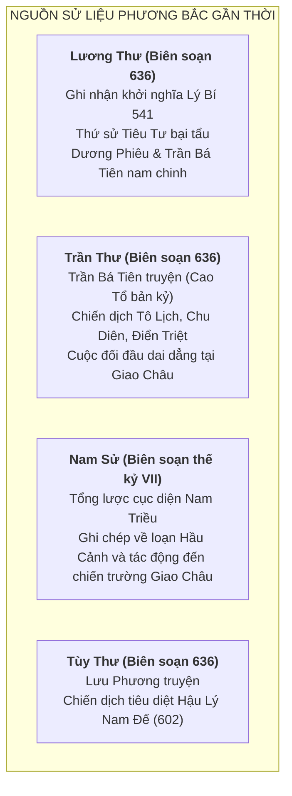
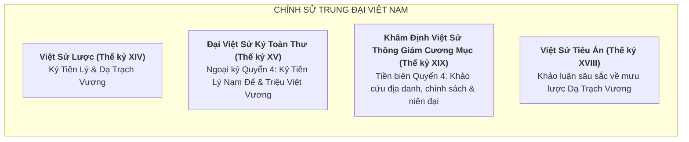

# Khảo Cứu Nguồn Sử Liệu & Thẩm Định Học Thuật: Thời Kỳ Nước Vạn Xuân (541–602 SCN)

> [!IMPORTANT]
> **Nguyên Tắc Thẩm Định Nguồn (Task `VS-VX-01`)**:
> - Tài liệu này cung cấp bức tranh toàn cảnh về toàn bộ các thư tịch lịch sử, bi ký, thần phả và truyền thuyết liên quan đến triều đại Tiền Lý (Lý Nam Đế), Triệu Việt Vương và Hậu Lý Nam Đế.
> - Bắt buộc phân định rạch ròi giữa **Sử liệu ghi nhận gần thời**, **Chính sử trung đại** và **Huyền tích dân gian (Móng Rồng, thần tích địa phương)**.

---

## 1. Nguồn Sơ Cấp Gần Thời Phương Bắc (Thế Kỷ VI–VII)

Các nguồn sử liệu này được biên soạn bởi các sử gia phương Bắc tương đối gần với thời điểm xảy ra sự kiện (thế kỷ VI–VII), ghi nhận các chiến dịch quân sự dưới góc nhìn của chính quyền đô hộ nhà Lương, nhà Trần và nhà Tùy.

### 1.1. *Lương Thư* (Biên soạn năm 636 bởi Diêu Tư Liêm thời Đường)
* **Các quyển liên quan**:
  * *Quyển 3 — Vũ Đế bản kỷ (Hạ)*: Ghi nhận sự kiện mùa đông năm Đại Đồng thứ 7 (541), người Giao Châu là Lý Bí nổi dậy chống lại Thứ sử Vũ Lâm hầu Tiêu Tư. Tiêu Tư hối lộ rồi bỏ chạy về Quảng Châu.
  * *Quyển 98 — Liệt truyện 92 (Chư di / Tây Nam di)*: Miêu tả việc nhà Lương sai Tôn Quýnh, Lư Tử Hùng đem quân sang đàn áp (542) nhưng bị thua và thoái lui; sau đó sai Thứ sử Dương Phiêu và Tư mã Trần Bá Tiên đem đại quân đàn áp (545).
* **Giá trị học thuật**: Xác nhận tính xác thực lịch sử 100% về quy mô cuộc khởi nghĩa, thời điểm bùng nổ (541) và tên tuổi các nhân vật chỉ huy cao cấp của cả hai bên.

---

### 1.2. *Trần Thư* (Biên soạn năm 636 bởi Diêu Tư Liêm)
* **Các quyển liên quan**:
  * *Quyển 1 — Cao Tổ bản kỷ (Trần Bá Tiên)*: Chép rất chi tiết hành trạng của Trần Bá Tiên từ khi còn là Tư mã quận Giao Chỉ đến khi thống lĩnh quân Lương tiến công Lý Bí.
  * Ghi nhận cụ thể các địa danh chiến trường: Sông Chu Diên, cửa sông Tô Lịch, thành Gia Ninh, hồ Điển Triệt và động Khuất Lão.
* **Giá trị học thuật**: Cung cấp tư liệu địa lý - quân sự quý giá nhất về chiến thuật công thủ, địa hình đầm hồ và sông ngòi của miền Bắc Việt Nam thế kỷ VI.

---

### 1.3. *Tùy Thư* (Biên soạn năm 636 bởi Ngụy Trưng thời Đường)
* **Các quyển liên quan**:
  * *Quyển 53 — Liệt truyện 18 (Lưu Phương truyện)*: Ghi chép về việc nhà Tùy sai tướng Lưu Phương đem 27 doanh quân tiến sang Giao Châu năm Nhân Thọ thứ 2 (602). Vua Nam triều là Lý Phật Tử đầu hàng tại Đô Long, kết thúc hoàn toàn kỷ nguyên nước Vạn Xuân.

---

## 2. Chính Sử Trung Đại Việt Nam (Thế Kỷ XIII–XIX)

Chính sử Việt Nam ghi chép lại tiến trình lịch sử với tinh thần tự tôn dân tộc, bổ sung đầy đủ hệ thống danh tính tướng lĩnh, thể chế triều đình Vạn Xuân, kinh đô, niên hiệu và các nhân vật mà sử phương Bắc bỏ qua hoặc lược bớt.

### 2.1. *Đại Việt Sử Ký Toàn Thư* (Ngô Sĩ Liên, khắc in 1479)
* **Nội dung cốt lõi**:
  * Khởi nghĩa Lý Bí (541), chiếm thành Long Biên (542).
  * Đánh tan quân Lâm Ấp xâm lấn phương Nam tại Cửu Đức dưới sự chỉ huy của Lão tướng Phạm Tu (543).
  * Mùa xuân năm 544: Lý Bí xưng Hoàng đế (Lý Nam Đế), đặt quốc hiệu **Vạn Xuân**, niên hiệu **Thiên Đức**, dựng điện Vạn Thọ, lập chùa **Khai Quốc**, đúc tiền đồng. Bổ nhiệm Tinh Thiều đứng đầu quan văn, Phạm Tu đứng đầu quan võ, Triệu Túc làm Thái phó.
  * Diễn biến kháng chiến chống Trần Bá Tiên (545–548); Lý Nam Đế trao quyền bính cho Triệu Quang Phục.
  * Triệu Quang Phục rút về căn cứ Dạ Trạch (Hưng Yên), dùng chiến thuật du kích đêm, xưng Dạ Trạch Vương; chém Dương Sàn năm 550 khôi phục kinh đô Long Biên.
  * Tranh chấp giữa Triệu Việt Vương và Lý Phật Tử; thảm kịch Nhã Lang - Cảo Nương (571).

---

### 2.2. *Khâm Định Việt Sử Thông Giám Cương Mục* (Quốc Sử Quán Triều Nguyễn, 1884)
* **Giá trị bổ sung**:
  * Khảo cứu và xác minh cẩn trọng các địa danh cổ:
    * *Đầm Dạ Trạch*: Thuộc huyện Khoái Châu, tỉnh Hưng Yên (vùng đầm lầy Màn Trù bãi Tự Nhiên).
    * *Hồ Điển Triệt*: Thuộc huyện Lập Thạch, tỉnh Vĩnh Phúc (vùng hồ đầm tự nhiên ăn thông ra sông Lô).
    * *Động Khuất Lão*: Thuộc huyện Tam Nông, tỉnh Phú Thọ (nơi Lý Nam Đế lui về dưỡng bệnh và tạ thế).
    * *Thành Tô Lịch*: Vùng ngã ba sông Tô Lịch giao sông Hồng (Hà Nội cổ).

---

## 3. Thần Tích, Truyền Thuyết & Di Tích Dân Gian (Folklore & Heritage)

### 3.1. *Lĩnh Nam Chích Quái* (Trần Thế Pháp, thế kỷ XIV)
* **Truyện Dạ Trạch Vương**:
  * Kể lại truyền thuyết khi Triệu Quang Phục lui vào đầm lầy hiểm trở Dạ Trạch, Chử Đồng Tử hiển linh trao chiếc **Móng Rồng (Long Trảo)** cài lên mũ đâu mâu để gia tăng thần lực bách chiến bách thắng.
  * **Đánh giá học thuật**: Đây là biểu tượng huyền thoại hóa lòng tin tâm linh và tinh thần mưu lược vượt trội của nhân dân ta, cần được gắn nhãn `Folklore / Legend` rõ ràng trong game.

### 3.2. Hệ Thống Đền Thờ & Thần Phả Địa Phương
1. **Đền thờ Dạ Trạch (Đền Hóa & Đền Triệu Việt Vương)**: Thôn Yên Vĩnh, xã Dạ Trạch, huyện Khoái Châu, Hưng Yên — Nơi tôn thờ Triệu Quang Phục và Chử Đồng Tử.
2. **Đền thờ Đô Hồ Đại Vương Phạm Tu**: Xã Thanh Liệt, huyện Thanh Trì, Hà Nội — Tôn vinh Lão tướng họ Phạm hy sinh vì non sông.
3. **Đền thờ Lý Nam Đế (Đền Giang Xá & Đền Mục Cương)**: Giang Xá (Hoài Đức, Hà Nội) và Văn Lương (Tam Nông, Phú Thọ) — Nơi lưu giữ thần tích về quê hương và lăng mộ Lý Nam Đế.
4. **Chùa Trấn Quốc (Tiền thân Chùa Khai Quốc)**: Đường Thanh Niên, Tây Hồ, Hà Nội — Công trình tâm linh biểu tượng cho nền độc lập dân tộc được dựng năm 544.

---

## 4. Bảng Tổng Hợp Độ Tin Cậy Của Các Chi Tiết Lịch Sử

| Chi Tiết / Nhân Vật | Nguồn Xác Nhận | Đánh Giá Độ Tin Cậy Học Thuật |
|---|---|:---:|
| Khởi nghĩa Lý Bí (541), đuổi Tiêu Tư | *Lương Thư*, *Trần Thư*, *Toàn Thư* | **Cực Kỳ Cao (Historical Fact)** |
| Quốc hiệu Vạn Xuân, Niên hiệu Thiên Đức (544) | *Toàn Thư*, *Cương Mục*, *Việt Sử Lược* | **Rất Cao (Chính sử Việt Nam)** |
| Tên tuổi Trần Bá Tiên, Dương Phiêu, Dương Sàn | *Lương Thư*, *Trần Thư*, *Toàn Thư* | **Cực Kỳ Cao (Historical Fact)** |
| Trận đánh Tô Lịch, Điển Triệt, Khuất Lão | *Trần Thư*, *Toàn Thư*, *Cương Mục* | **Cực Kỳ Cao (Historical Fact)** |
| Triệu Quang Phục lập căn cứ đầm Dạ Trạch | *Toàn Thư*, *Cương Mục*, *Lĩnh Nam Chích Quái* | **Rất Cao (Chính sử + Thần tích)** |
| Lão tướng Phạm Tu phá tan giặc Lâm Ấp (543) | *Toàn Thư*, *Cương Mục*, Thần phả Thanh Liệt | **Rất Cao (Chính sử + Thần phả)** |
| Tinh Thiều bất bình vì chức gác cổng Tây Viên | *Toàn Thư*, *Cương Mục* | **Cao (Chính sử trung đại)** |
| Truyền thuyết Móng Rồng Chử Đồng Tử | *Lĩnh Nam Chích Quái*, Thần tích Dạ Trạch | **Folklore / Huyền tích dân gian** |
| Chuyện tình bi kịch Nhã Lang — Cảo Nương | *Toàn Thư*, *Lĩnh Nam Chích Quái* | **Folklore / Văn học dân gian** |
